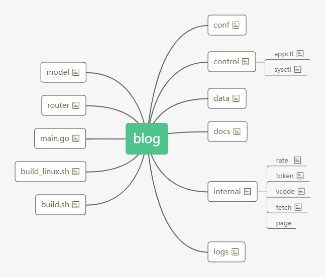
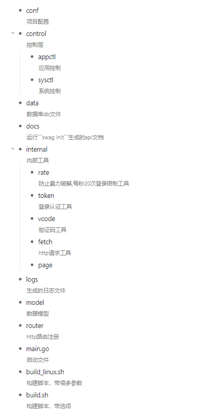

# 项目解读

## 项目结构




## 技术栈
- golang [https://golang.google.cn](https://golang.google.cn)
- xorm [https://xorm.io](https://xorm.io)
- echo [https://echo.labstack.com](https://echo.labstack.com)

## 使用方法
### 开发环境
- 安装依赖```go mod tidy```
- 生成   
    - 安装 swag ```go get -u github.com/swaggo/swag/cmd/swag```
    - 运行```swag init```生成api文档
- 运行后台```go run main.go```
- 浏览器默认访问 [http://127.0.0.1:8085/](http://127.0.0.1:8085/)
- swagger地址 [http://localhost:8085/swagger/index.html](http://localhost:8085/swagger/index.html)
  
  
### build环境
- 配置```conf.toml```数据库信息
- 还原```data```目录下```db.sql```数据库
- 安装依赖```go mod tidy```
- 编译可执行程序 
    - 普通开发编译版本```go build```
    - 编译不带日志和swagger文档版本```go build -tags=prod```体积大幅度减小,日志请用```nginx、caddy```等```web```服务器记录
- 服务器部署
    - windows 直接运行
    - linux 普通方式```nohup ./blog>>nohup.log 2>&1 &```

### 举例dockerfile安装
- 生成镜像```docker build -t q1090858499/blog:v1 .```  
- 运行镜像
  - 使用容器通道--link=mysql-8.0.27:mysql-ss，如果安装的mysql也在容器内，且mysql的容器名是mysql-8.0.27，那么可以用mysql-ss代替要访问的mysql的IP
  ```docker run   -dit --name blog --restart=always -p 8085:8085  --link=mysql-8.0.27:mysql-ss q1090858499/blog:v1```

## 原项目
  [github(https://github.com/zxysilent/blog)](https://github.com/zxysilent/blog)